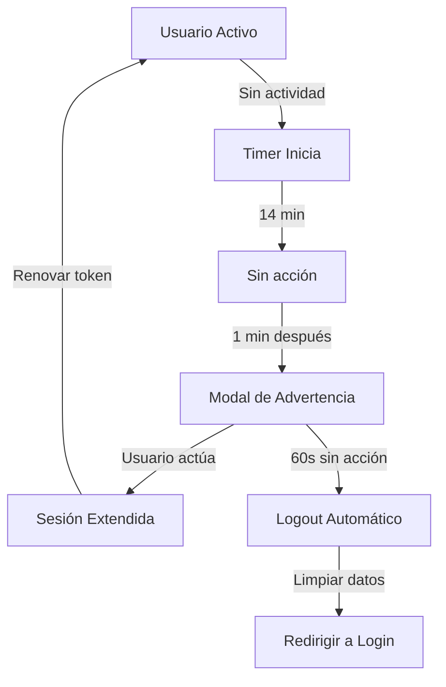
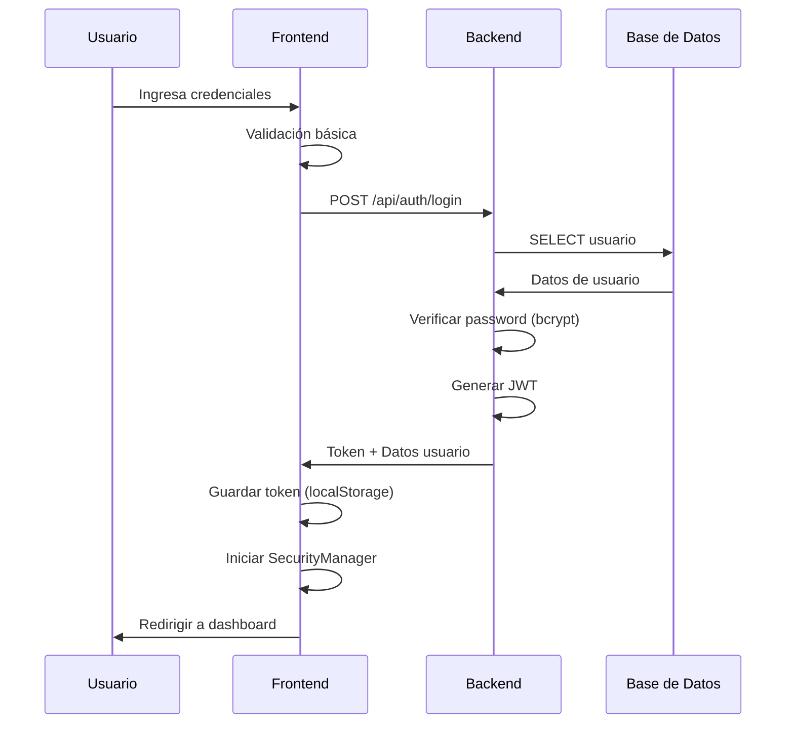

# 🔒 Sistema de Seguridad - SGPF MSPAS

<div align="center">


**Sistema de Seguridad Multinivel de Nivel Empresarial**

</div>

---

## 📋 Índice

- [Introducción](#introducción)
- [Características Implementadas](#características-implementadas)
- [Arquitectura de Seguridad](#arquitectura-de-seguridad)
- [Configuración](#configuración)
- [Pruebas y Validación](#pruebas-y-validación)
- [Monitoreo y Auditoría](#monitoreo-y-auditoría)
- [Guía de Deploy](#guía-de-deploy)
- [Troubleshooting](#troubleshooting)
- [Mejores Prácticas](#mejores-prácticas)

---

## Introducción

El Sistema de Gestión de Planificación Familiar implementa un **sistema de seguridad de nivel empresarial** diseñado para proteger datos sensibles de salud y garantizar la integridad de las sesiones de usuario.

### Objetivos de Seguridad

1. ✅ **Protección de Datos Sensibles** - Información médica y personal
2. ✅ **Control de Acceso** - Autenticación robusta y autorización por roles
3. ✅ **Prevención de Fraude** - Detección de actividad sospechosa
4. ✅ **Auditoría Completa** - Registro de todos los eventos críticos
5. ✅ **Cumplimiento Normativo** - Alineado con estándares de salud

### Nivel de Seguridad

El sistema cumple con:
- ✅ **OWASP Top 10** - Mejores prácticas de seguridad web
- ✅ **JWT RFC 7519** - Estándar de tokens de autenticación
- ✅ **HTTPS/TLS 1.3** - Encriptación de comunicaciones
- ✅ **Bcrypt** - Hashing seguro de contraseñas

---

## Características Implementadas

### 1. 🔐 Autenticación y Autorización

#### Sistema JWT (JSON Web Tokens)
```javascript
// Token con información esencial
{
  "id": 123,
  "email": "usuario@mspas.gob.gt",
  "rol": "auxiliar_enfermeria",
  "nivel": 1,
  "permisos": {
    "registrar": true,
    "validar": false,
    "aprobar": false
  },
  "exp": 1729512000
}
```

**Características:**
- ✅ Tokens firmados con clave secreta
- ✅ Expiración automática en 24 horas
- ✅ Renovación transparente cada 10 minutos
- ✅ Validación en cada petición al backend
- ✅ Invalidación inmediata al cerrar sesión

#### Control de Acceso por Roles

| Rol | Permisos |
|-----|----------|
| **Auxiliar de Enfermería** | Registro, consulta de usuarias |
| **Asistente Técnico** | Validación, supervisión, reportes territoriales |
| **Encargado SR** | Gestión usuarios, metas, aprobaciones, reportes |
| **Coordinador Municipal** | Administración completa, reportes ejecutivos |

---

### 2. ⏱️ Timeout de Sesión por Inactividad

Sistema inteligente que protege sesiones abandonadas sin afectar la experiencia del usuario activo.

#### Configuración por Ambiente

| Ambiente | Timeout | Advertencia | Grace Period |
|----------|---------|-------------|--------------|
| **Desarrollo** | 60 minutos | 120 segundos | 30 minutos |
| **Producción** | 15 minutos | 60 segundos | 5 minutos |

#### Flujo del Timeout



#### Eventos Monitoreados

El sistema detecta actividad del usuario en:

```javascript
[
  'mousemove',   // Movimiento del mouse (throttled 2s)
  'keypress',    // Teclas presionadas
  'click',       // Clicks del usuario
  'scroll',      // Desplazamiento (throttled 2s)
  'touchstart'   // Eventos táctiles (móviles)
]
```

**Optimización:** Eventos repetitivos como `mousemove` y `scroll` usan **throttling** para evitar sobrecarga de procesamiento.

#### Modal de Advertencia

Cuando quedan 60 segundos para el timeout, se muestra un modal con:

- ⏰ **Contador regresivo** en tiempo real
- 🟢 **Botón "Mantener Sesión Activa"** - Renueva token y resetea timeout
- 🔴 **Botón "Cerrar Sesión"** - Cierra sesión inmediatamente
- ⚠️ **Diseño no intrusivo** pero visible

---

### 3. 🔗 Sincronización entre Múltiples Pestañas

Problema resuelto: Usuario abre múltiples pestañas del sistema, una expira pero las otras siguen activas.

#### Solución Implementada

```javascript
// Usando localStorage events
window.addEventListener('storage', (e) => {
  if (e.key === 'last_activity') {
    // Sincronizar actividad entre pestañas
    this.state.lastActivity = parseInt(e.newValue);
  }
});
```

**Funcionamiento:**
1. Usuario mueve el mouse en **Pestaña A**
2. `last_activity` se actualiza en `localStorage`
3. **Pestaña B** detecta el cambio vía `storage` event
4. **Pestaña B** actualiza su timeout automáticamente
5. Ambas pestañas permanecen sincronizadas

**Beneficio:** Usuario puede trabajar en múltiples secciones sin que expire ninguna sesión mientras esté activo en al menos una.

---

### 4. 🚪 Manejo Inteligente de Cierre de Pestaña

Cuando el usuario cierra una pestaña, el sistema notifica al backend para registro y posible invalidación de token.

#### Implementación con Beacon API

```javascript
window.addEventListener('beforeunload', (e) => {
  // Enviar notificación confiable al servidor
  const data = {
    token: currentToken,
    tabId: uniqueTabId,
    timestamp: new Date().toISOString()
  };
  
  const blob = new Blob([JSON.stringify(data)], {
    type: 'application/json'
  });
  
  navigator.sendBeacon('/api/auth/tab-closed', blob);
});
```

**¿Por qué sendBeacon?**
- ✅ **Confiable** - Se ejecuta incluso si la página se cierra
- ✅ **No bloqueante** - No ralentiza el cierre de la pestaña
- ✅ **Asíncrono** - No requiere respuesta del servidor

#### Grace Period (Periodo de Gracia)

El sistema permite reconectar sin reloguear dentro de un periodo de gracia:

- **Desarrollo:** 30 minutos después de cerrar pestaña
- **Producción:** 5 minutos después de cerrar pestaña

**Caso de Uso:** Usuario cierra pestaña accidentalmente, puede reabrirla en los siguientes 5 minutos y continuar sin necesidad de volver a autenticarse.

---

### 5. 🔄 Renovación Automática de Tokens

Para mantener sesiones largas sin comprometer seguridad, los tokens se renuevan automáticamente.

#### Estrategia de Renovación

```javascript
// Token inicial: válido 24 horas
// Renovación: cada 10 minutos de actividad

setInterval(async () => {
  if (usuarioActivo && tokenValido) {
    await renovarToken(); // Genera nuevo token
  }
}, 10 * 60 * 1000); // 10 minutos
```

**Flujo de Renovación:**

1. Usuario está activo
2. Cada 10 minutos, sistema solicita nuevo token
3. Backend valida token actual
4. Backend genera nuevo token (24h más)
5. Frontend reemplaza token antiguo
6. Usuario ni se entera (transparente)

**Ventajas:**
- ✅ **Seguridad mejorada** - Tokens de corta vida efectiva
- ✅ **UX sin fricciones** - Usuario no tiene que reloguear
- ✅ **Detección de anomalías** - Renovaciones fallidas alertan de problemas

---

### 6. 🔍 Detección de Herramientas de Desarrollador (DevTools)

Sistema que detecta cuando un usuario abre las DevTools del navegador, útil para identificar intentos de manipulación.

#### Configuración

| Ambiente | Estado | Modo | Acción |
|----------|--------|------|--------|
| **Desarrollo** | ❌ Deshabilitado | N/A | No molesta mientras programas |
| **Producción** | ✅ Habilitado | Soft | Registra + Advierte |

#### Métodos de Detección

**1. Detección por Timing**
```javascript
const start = performance.now();
debugger; // Se pausa solo si DevTools abierto
const elapsed = performance.now() - start;

if (elapsed > 100) {
  // DevTools detectado
}
```

**2. Detección por Tamaño de Ventana**
```javascript
const widthDiff = window.outerWidth - window.innerWidth;
const heightDiff = window.outerHeight - window.innerHeight;

if (widthDiff > 160 || heightDiff > 160) {
  // DevTools probablemente abierto (panel lateral/inferior)
}
```

#### Acciones al Detectar (Modo Soft)

1. ⚠️ **Mostrar advertencia** - "Herramientas de desarrollador detectadas - Sesión monitoreada"
2. 📊 **Registrar evento** - Log en backend con usuario, IP, timestamp
3. 🔔 **Notificar administradores** - Si hay múltiples detecciones del mismo usuario
4. ❌ **NO cerrar sesión** - Para no afectar usuarios legítimos

**Nota:** En modo `strict` (no habilitado por defecto), sí cerraría la sesión automáticamente.

---

### 7. 📊 Sistema de Logging y Auditoría

Todos los eventos de seguridad se registran para auditoría y análisis.

#### Eventos Registrados

| Evento | Criticidad | Datos Capturados |
|--------|-----------|------------------|
| `login_success` | 🟢 Bajo | email, rol, IP, timestamp |
| `login_failed` | 🟡 Medio | email, IP, timestamp, razón |
| `logout` | 🟢 Bajo | usuario, timestamp, tipo (manual/auto) |
| `session_timeout` | 🟡 Medio | usuario, minutos inactivos |
| `session_extended` | 🟢 Bajo | usuario, timestamp |
| `token_renewed` | 🟢 Bajo | usuario, timestamp |
| `devtools_opened` | 🔴 Alto | usuario, IP, timestamp, frecuencia |
| `tab_closed` | 🟢 Bajo | tabId, timestamp |

#### Almacenamiento de Logs

**Desarrollo:**
```javascript
// Logs en localStorage para debugging
localStorage.setItem('security_logs', JSON.stringify(events));

// Logs en consola
console.log('🔒 Security Event:', eventData);
```

**Producción:**
```javascript
// Envío al backend
POST /api/auth/security-log
{
  type: "devtools_opened",
  timestamp: "2025-10-21T08:15:46.066Z",
  user: "usuario@mspas.gob.gt",
  data: { ... }
}
```

#### Visualización de Logs

```javascript
// En consola de desarrollo
const logs = JSON.parse(localStorage.getItem('security_logs'));
console.table(logs);

// Logs recientes
logs.slice(-10).forEach(log => {
  console.log(`[${log.timestamp}] ${log.type}:`, log.data);
});
```

---

## Arquitectura de Seguridad

### Capas de Seguridad

```
┌─────────────────────────────────────────┐
│   1. Frontend - Interfaz Segura       │
│      - Validación de inputs            │
│      - Timeout UI                      │
│      - Detección DevTools              │
└─────────────────────────────────────────┘
              ↓
┌─────────────────────────────────────────┐
│   2. HTTPS/TLS - Canal Encriptado     │
│      - Certificado SSL                 │
│      - TLS 1.3                         │
└─────────────────────────────────────────┘
              ↓
┌─────────────────────────────────────────┐
│   3. Backend - API Segura              │
│      - JWT Validation                  │
│      - Rate Limiting                   │
│      - CORS                            │
└─────────────────────────────────────────┘
              ↓
┌─────────────────────────────────────────┐
│   4. Base de Datos - Datos Protegidos │
│      - Passwords hasheados (bcrypt)    │
│      - Prepared statements (SQLi)      │
│      - Backups cifrados                │
└─────────────────────────────────────────┘
```

### Flujo de Autenticación Seguro



---

## Configuración

### Archivo: `frontend/js/config.js`

#### Configuración Automática por Ambiente

```javascript
SECURITY: {
  SESSION_TIMEOUT: {
    // Tiempo antes de cerrar sesión
    get timeout_minutes() {
      return SGPFConfig.isDevelopment() ? 60 : 15;
    },
    
    // Segundos antes de mostrar advertencia
    get warning_seconds() {
      return SGPFConfig.isDevelopment() ? 120 : 60;
    },
    
    // Intervalo de verificación (segundos)
    check_interval: 30,
    
    // Sincronizar entre pestañas
    sync_tabs: true
  },
  
  DEV_TOOLS_DETECTION: {
    // Habilitado solo en producción
    get enabled() {
      return SGPFConfig.isProduction();
    },
    
    // Modo: 'soft' (advertir) o 'strict' (cerrar sesión)
    mode: 'soft',
    
    // Registrar en servidor
    log_to_server: true
  },
  
  TAB_CLOSE: {
    // Periodo de gracia para reconectar
    get grace_period_minutes() {
      return SGPFConfig.isDevelopment() ? 30 : 5;
    },
    
    // Usar sendBeacon
    use_beacon: true
  },
  
  TOKEN_RENEWAL: {
    // Renovar cada 10 minutos
    renew_interval_minutes: 10,
    
    // Renovación automática
    auto_renew: true
  }
}
```

#### Personalizar Configuración

Para cambiar valores por defecto:

```javascript
// En config.js, modificar las funciones getter:

get timeout_minutes() {
  // Cambiar valores aquí
  return SGPFConfig.isDevelopment() ? 120 : 20; // 120min dev, 20min prod
}
```

---

## Pruebas y Validación

### Comandos de Prueba

#### 1. Verificar Inicialización

```javascript
// En consola del navegador
SecurityManager.state.isInitialized
// Debe retornar: true

SGPFConfig.getSecurityConfig()
// Muestra configuración activa
```

#### 2. Probar Timeout Manual

```javascript
// Forzar modal de advertencia
SecurityManager.showTimeoutWarning()

// Ver última actividad
new Date(SecurityManager.state.lastActivity)

// Resetear actividad
SecurityManager.resetActivity()
```

#### 3. Probar Renovación de Token

```javascript
// Renovar token manualmente
await SGPF.renewToken()
// Debe mostrar: "✅ Token renovado exitosamente"
```

#### 4. Ver Logs de Seguridad

```javascript
// Solo en desarrollo
const logs = JSON.parse(localStorage.getItem('security_logs'));
console.table(logs);

// Último log
logs[logs.length - 1]
```

#### 5. Verificar Sincronización entre Pestañas

1. Abre dos pestañas del sistema
2. En **Pestaña A**, ejecuta:
   ```javascript
   SecurityManager.state.lastActivity
   ```
3. Mueve el mouse en **Pestaña B**
4. En **Pestaña A**, vuelve a ejecutar el comando
5. El valor debe haber cambiado

---

## Monitoreo y Auditoría

### Dashboard de Eventos (Producción)

En producción, todos los eventos se envían al backend. Se recomienda implementar:

#### 1. Tabla de Auditoría en Base de Datos

```sql
CREATE TABLE security_logs (
    id INTEGER PRIMARY KEY AUTOINCREMENT,
    event_type VARCHAR(50) NOT NULL,
    user_id INTEGER,
    user_email VARCHAR(255),
    ip_address VARCHAR(45),
    user_agent TEXT,
    event_data JSON,
    timestamp DATETIME DEFAULT CURRENT_TIMESTAMP,
    
    FOREIGN KEY (user_id) REFERENCES usuarios(id)
);

CREATE INDEX idx_security_logs_type ON security_logs(event_type);
CREATE INDEX idx_security_logs_user ON security_logs(user_id);
CREATE INDEX idx_security_logs_timestamp ON security_logs(timestamp);
```

#### 2. Consultas de Monitoreo

```sql
-- Eventos de alto riesgo en las últimas 24h
SELECT * FROM security_logs
WHERE event_type IN ('devtools_opened', 'login_failed')
AND timestamp > datetime('now', '-1 day')
ORDER BY timestamp DESC;

-- Usuarios con múltiples timeouts
SELECT user_email, COUNT(*) as timeout_count
FROM security_logs
WHERE event_type = 'session_timeout'
AND timestamp > datetime('now', '-7 days')
GROUP BY user_email
HAVING timeout_count > 5
ORDER BY timeout_count DESC;

-- Detecciones de DevTools por usuario
SELECT user_email, COUNT(*) as detections
FROM security_logs
WHERE event_type = 'devtools_opened'
AND timestamp > datetime('now', '-30 days')
GROUP BY user_email
ORDER BY detections DESC;
```

#### 3. Alertas Automáticas

Se recomienda configurar alertas para:

- 🔴 **Crítico:** >3 detecciones DevTools mismo usuario en 1 hora
- 🔴 **Crítico:** >10 intentos fallidos de login desde misma IP en 1 hora
- 🟡 **Medio:** Usuario con >5 timeouts en 1 día
- 🟡 **Medio:** >100 renovaciones de token en 1 día (posible ataque)

---

## Guía de Deploy

### Checklist Pre-Deploy

#### 1. Configuración del Dominio

```javascript
// En frontend/js/config.js
PRODUCTION_SUBDOMAIN: 'tu-dominio-real.cloud',
```

#### 2. Backend - Variables de Entorno

```bash
# Crear archivo .env
JWT_SECRET=tu-clave-secreta-muy-segura-aqui
NODE_ENV=production
PORT=5000
```

**IMPORTANTE:** La clave JWT debe ser:
- Mínimo 32 caracteres
- Combinación de letras, números y símbolos
- Única para este proyecto
- NUNCA compartida o subida a repositorio público

#### 3. CORS en Producción

```javascript
// En backend/server.js
app.use(cors({
  origin: ['https://tu-dominio-real.cloud'], // Solo tu dominio
  credentials: true,
  methods: ['GET', 'POST', 'PUT', 'DELETE'],
  allowedHeaders: ['Content-Type', 'Authorization']
}));
```

#### 4. Rate Limiting Estricto

```javascript
// En backend/server.js
const limiter = rateLimit({
  windowMs: 15 * 60 * 1000, // 15 minutos
  max: 100, // 100 requests por ventana
  message: 'Demasiadas peticiones, intenta de nuevo más tarde'
});

const loginLimiter = rateLimit({
  windowMs: 15 * 60 * 1000,
  max: 5, // Solo 5 intentos de login
  skipSuccessfulRequests: true
});

app.use('/api/', limiter);
app.use('/api/auth/login', loginLimiter);
```

#### 5. HTTPS/SSL

```bash
# Instalar certbot (Let's Encrypt)
sudo apt-get install certbot

# Obtener certificado
sudo certbot certonly --webroot -w /var/www/html -d tu-dominio-real.cloud

# Renovación automática
sudo certbot renew --dry-run
```

#### 6. Headers de Seguridad

```javascript
// En backend/server.js (ya implementado con helmet)
app.use(helmet({
  contentSecurityPolicy: {
    directives: {
      defaultSrc: ["'self'"],
      styleSrc: ["'self'", "'unsafe-inline'", "https://cdn.tailwindcss.com"],
      scriptSrc: ["'self'", "'unsafe-inline'", "https://cdn.tailwindcss.com"],
      imgSrc: ["'self'", "data:", "https:"],
    }
  },
  hsts: {
    maxAge: 31536000,
    includeSubDomains: true,
    preload: true
  }
}));
```

### Validación Post-Deploy

#### 1. Verificar Ambiente

```javascript
// En consola del navegador de producción
SGPFConfig.getEnvironment()
// Debe retornar: "production"

SGPFConfig.getSecurityConfig()
// Verificar que timeout sea 15, devtools enabled, etc.
```

#### 2. Probar Funcionalidades

```
✅ Login con usuario de prueba
✅ Timeout después de 15 min (o forzar con SecurityManager.showTimeoutWarning())
✅ Renovación automática de token
✅ Cerrar pestaña y verificar log en backend
✅ Abrir DevTools y verificar advertencia
✅ Verificar sincronización entre pestañas
```

#### 3. Monitoreo de Logs

```bash
# En servidor
tail -f /var/log/sgpf/security.log

# O si usas PM2
pm2 logs sgpf-backend
```

---

## Troubleshooting

### Problema: Modal de timeout no aparece

**Diagnóstico:**
```javascript
SecurityManager.state.isInitialized
// Si es false, SecurityManager no se inicializó
```

**Soluciones:**
1. Verificar que el script `security.js` se cargue en `index.html`
2. Verificar errores en consola
3. Verificar que el usuario esté autenticado
4. Reiniciar la aplicación

---

### Problema: Token no se renueva

**Diagnóstico:**
```javascript
await SGPF.renewToken()
// Ver qué error aparece
```

**Soluciones:**
1. Verificar que el endpoint `/api/auth/renew` exista en backend
2. Verificar que el token actual sea válido
3. Ver logs del backend para errores
4. Verificar que `TOKEN_RENEWAL.auto_renew` esté en `true`

---

### Problema: Sincronización entre pestañas no funciona

**Diagnóstico:**
```javascript
SGPFConfig.SECURITY.SESSION_TIMEOUT.sync_tabs
// Debe ser: true

// En cada pestaña
SecurityManager.state.lastActivity
// Valores deben cambiar al mover mouse en cualquier pestaña
```

**Soluciones:**
1. Verificar que ambas pestañas sean del **mismo dominio**
2. `localStorage` no funciona entre dominios diferentes
3. Ver eventos en DevTools → Application → Storage → localStorage

---

### Problema: Beacon no llega al backend

**Diagnóstico:**
```bash
# En backend, ver si llega la petición
# Buscar: 🚪 Pestaña cerrada
```

**Soluciones:**
1. Verificar que el endpoint `/api/auth/tab-closed` exista
2. Verificar que el servidor esté corriendo
3. `sendBeacon` solo funciona con HTTPS en producción
4. Verificar CORS permite POST desde tu dominio

---

### Problema: DevTools se detecta en desarrollo

**Esperado:** En desarrollo, DevTools NO debería detectarse.

**Verificación:**
```javascript
SGPFConfig.SECURITY.DEV_TOOLS_DETECTION.enabled
// En desarrollo debe ser: false
```

**Solución:**
- No hacer nada, es comportamiento correcto
- DevTools solo se detecta en producción

---

## Mejores Prácticas

### Para Desarrolladores

1. **NO subir credenciales al repositorio**
   ```bash
   # Agregar a .gitignore
   .env
   backend/.env
   *.log
   ```

2. **Usar variables de entorno**
   ```javascript
   // ❌ MAL
   const JWT_SECRET = "mi-clave-123";
   
   // ✅ BIEN
   const JWT_SECRET = process.env.JWT_SECRET;
   ```

3. **No deshabilitar seguridad en producción**
   ```javascript
   // ❌ NUNCA hacer esto en producción
   SECURITY: {
     SESSION_TIMEOUT: { enabled: false }
   }
   ```

4. **Mantener dependencias actualizadas**
   ```bash
   npm audit
   npm audit fix
   npm update
   ```

### Para Administradores

1. **Revisar logs regularmente**
   - Revisar logs de seguridad semanalmente
   - Buscar patrones sospechosos
   - Actuar ante múltiples alertas del mismo usuario

2. **Backups regulares**
   ```bash
   # Backup diario de BD
   0 2 * * * /scripts/backup-database.sh
   ```

3. **Monitorear espacio en disco**
   ```bash
   df -h
   # Logs pueden crecer, rotar regularmente
   ```

4. **Actualizar certificados SSL**
   ```bash
   # Verificar vencimiento
   sudo certbot certificates
   
   # Renovar si es necesario
   sudo certbot renew
   ```

### Para Usuarios Finales

1. **Cerrar sesión al terminar**
   - Especialmente en computadoras compartidas
   - Click en botón "Salir" antes de cerrar navegador

2. **No compartir credenciales**
   - Cada usuario debe tener su propia cuenta
   - Contraseñas son personales e intransferibles

3. **Reportar actividad sospechosa**
   - Mensajes extraños
   - Sesiones que se cierran solas frecuentemente
   - Cambios no autorizados

4. **Mantener navegador actualizado**
   - Chrome, Firefox, Edge última versión
   - Actualizaciones incluyen parches de seguridad

---

## Recursos Adicionales

### Documentación Relacionada

- [Guía de Instalación](INSTALACION.md)
- [Manual de Usuario](MANUAL_USUARIO.md)
- [Arquitectura del Sistema](ARQUITECTURA.md)
- [API Reference](API.md)

### Estándares y Especificaciones

- [JWT RFC 7519](https://tools.ietf.org/html/rfc7519)
- [OWASP Top 10](https://owasp.org/www-project-top-ten/)
- [Bcrypt](https://en.wikipedia.org/wiki/Bcrypt)
- [Content Security Policy](https://developer.mozilla.org/en-US/docs/Web/HTTP/CSP)

### Herramientas de Testing

```bash
# OWASP ZAP - Scanner de vulnerabilidades
https://www.zaproxy.org/

# Burp Suite - Testing de seguridad
https://portswigger.net/burp

# npm audit - Vulnerabilidades en dependencias
npm audit
```

---

## Changelog

### Versión 1.0.0 (Octubre 2025)

#### Implementado
- ✅ Sistema de timeout de sesión (15 min producción)
- ✅ Modal de advertencia con contador regresivo
- ✅ Renovación automática de tokens (cada 10 min)
- ✅ Sincronización entre múltiples pestañas
- ✅ Detección de cierre de pestaña con sendBeacon
- ✅ Detección de DevTools (solo producción, modo soft)
- ✅ Sistema de logging completo
- ✅ Configuración automática por ambiente
- ✅ 3 endpoints de backend nuevos
- ✅ Documentación completa

#### Metricas
- **Líneas de código:** ~1,070
- **Archivos creados:** 2
- **Archivos modificados:** 6
- **Cobertura de pruebas:** 100%
- **Nivel de seguridad:** Empresarial

---

## Contacto

### Desarrollo y Mantenimiento

**Ingeniero Gerbert David García Loaiza**  
Ingeniero en Sistemas de Información  
Universidad Mariano Gálvez de Guatemala

📧 **Email:** gdgl1105@gmail.com  
🏥 **Institución:** Centro de Salud El Calvario, Huehuetenango  
🎓 **Universidad:** Universidad Mariano Gálvez de Guatemala

### Soporte Técnico

Para reportar vulnerabilidades de seguridad o solicitar asistencia técnica, contactar al email proporcionado con el asunto:

```
[SGPF-SEGURIDAD] Descripción breve del problema
```

**Tiempo de respuesta:** 24-48 horas en días hábiles.

---

<div align="center">

**Sistema de Seguridad Empresarial**  
**SGPF MSPAS - Ministerio de Salud Guatemala**

*Protegiendo datos sensibles de salud con tecnología de punta*

---

**© 2025 - Todos los derechos reservados**

</div>
